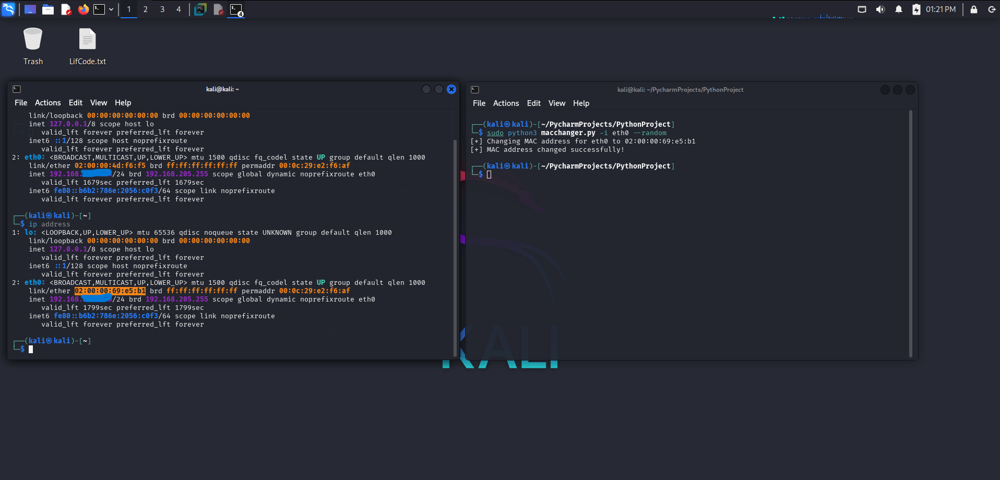

# 🕵️‍♂️ MAC Address Changer

A modern and flexible Python tool to change your MAC address using the ip command.
Supports manual MAC assignment or random generation using real vendor prefixes (OUI).

---

## ✨ Features

- ✅ Uses the modern ip command (no ifconfig)
- 🎲 Supports random MAC address generation with real vendor prefixes
- 📌 Compatible with modern Linux distributions (Kali, Ubuntu, Debian, etc.)
- 🧪 Great for privacy testing, virtual labs, or pentesting environments

---

## 🚀 Usage

### 🔧 Change MAC address manually

sudo python3 mac_changer.py -i eth0 -m 00:11:22:33:44:55

sudo python3 mac_changer.py -i eth0 --random

## 🔎 Screenshots

### ▶️ Usage Example

### ✅ Successful MAC Change

